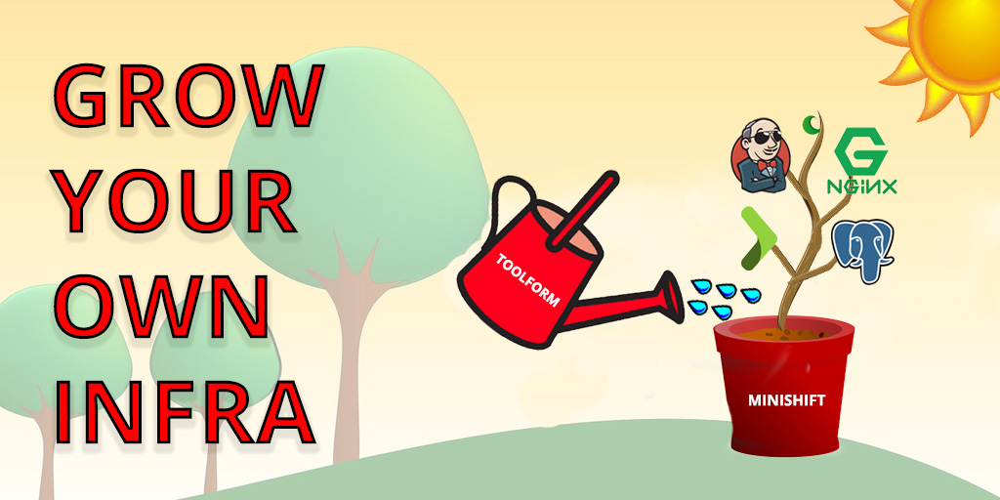

# Grow Your Own Infrastructure
## Just Add [Toolform](https://github.com/agiledigital/toolform)!

### Summary

[Toolform](https://github.com/agiledigital/toolform) is a "DevOps" utility for defining repeatable deployment environments so that applications can be developed independently of their deployment environment.

We use [Toolform](https://github.com/agiledigital/toolform) here at Agile Digital to do the heavy lifting when spinning up staging and production environments for projects, but there are still a few manual steps that mean that it isn't the first tool we reach for when we want to quickly to spin up a local development environment in an isolated environment for testing.

"Grow Your Own Infra" is a [Fedex Day](http://www.ianjones.co/2014/06/what-is-fedex-day.html) project that aims to address this issue by automating the entire process of spinning up a development enviroment from scratch entirely from a [Toolform Project File](https://github.com/agiledigital/toolform#project-configuration).

Apart from preparation work (like this repo and README) this project will be worked on over one day at Agile Digital (2018/03/16).

_Warning!_ This project has many gratuitous analogies.

### Ingredients

#### The "Soil"
To grow some good infrastructure you need to make sure that you have a solid base for it to grow out of. For this project [Minishift](https://github.com/minishift/minishift) will be used as it has all the tools provided by [OpenShift](https://www.openshift.com/) such as a docker registry and builds to support the automation process.

#### The "Seed"
The test project that will be used to grow the infrastucture will be a simple test app based on the [Play Framework](https://www.playframework.com/)/[Scala](https://www.scala-lang.org/), backed by [Postgres](https://www.postgresql.org/) and fronted by [Nginx](https://www.nginx.com/). This is a stack commonly used at Agile Digital and so the seed will be not have to be developed especially for this project.

#### The "Water"
[Toolform](https://github.com/agiledigital/toolform) will take the [Toolform Project File](https://github.com/agiledigital/toolform#project-configuration) in the seed and create Jenkins pipelines and OpenShift/Kubernetes deployment configuration templates.

#### The "Sun"
The final ingredient for the infrastructure to grow healthy and strong is this project itself. The "Grow Your Own Infra" tool will make sure that the Minishift environment is ready, deploy Jenkins, create and trigger the relevent build jobs and verify that the deployment succeded. Once the infrastucture has been created, it should also be able to tear it down again.

### Tasks
- [ ] Create command line harness using Scala and [Decline](https://github.com/bkirwi/decline) (Copy Toolform project)
- [ ] Interface with Minishift to control deployment (kubernetes)
- [ ] Deploy Jenkins to Minishift (use OpenShift provided template)
- [ ] Add build jobs to Jenkins to build images and deploy jobs to create deployments in OpenShift to run the images (using Toolform Jenkins pipeline generation)
- [ ] Trigger the Jenkins jobs automatically (rest API?)
- [ ] Verify the the deployment succeeded (health check API?)
- [ ] Tear it all down

